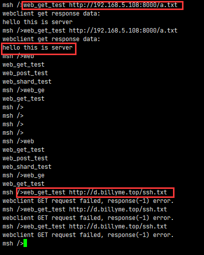
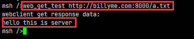
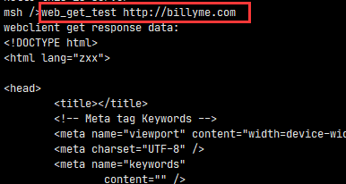
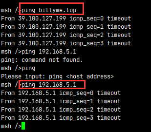
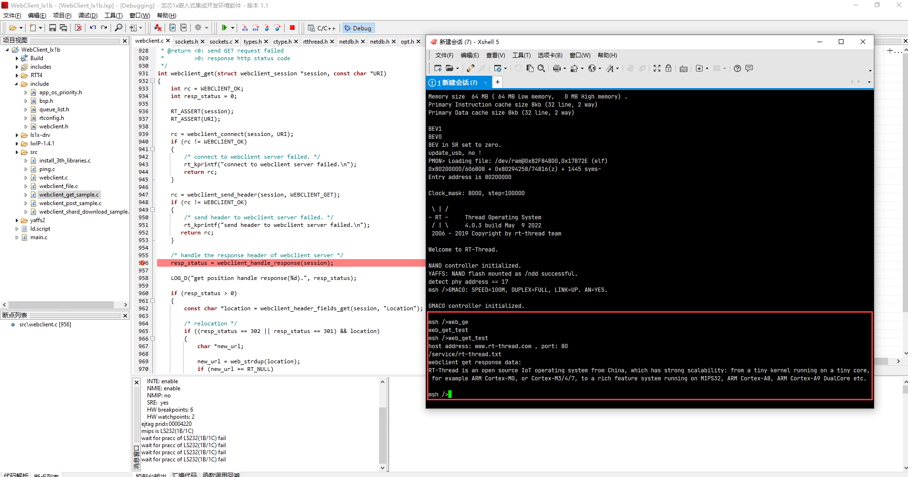

## LX1B200 WebClient 移植

2022/5/9 暂时只能直接访问ip，dns解析无法使用

解决办法： 本地路由器拦截设置域名billyme.com为本地服务器192.168.5.108， 重新访问billyme.com

证明本地域名解析是正常的

重新测试发现无法访问外部ip，只能访问内部局域网ip

## 移植Ping，LwIP没有实现ping

移植后出现部分问题，

可以看见dns解析是正常的，billyme.top确实指向该地址

调试情况下可以运行，不清楚为什么，可能是时间限制

